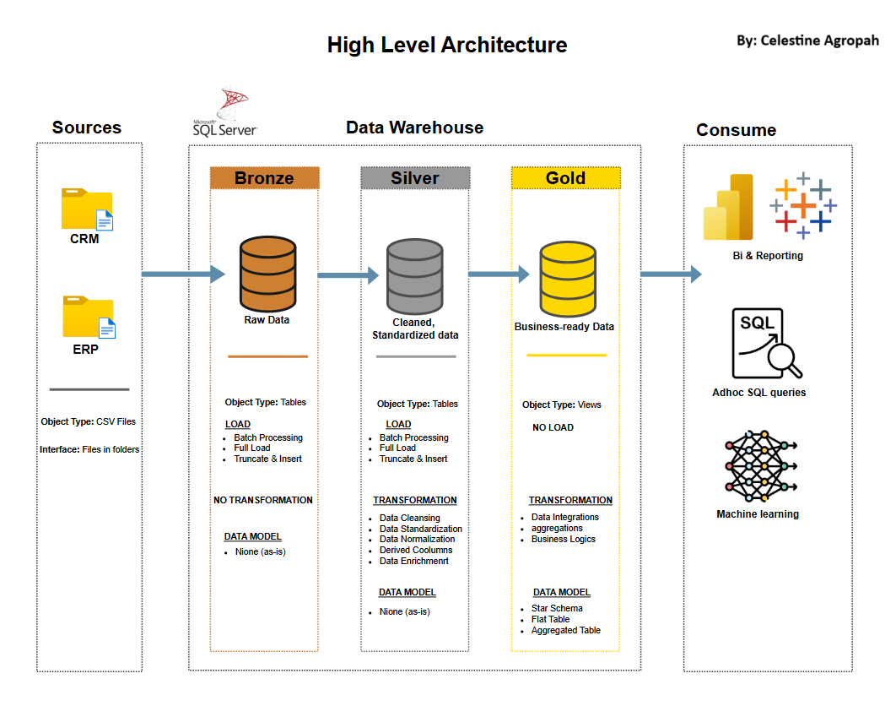
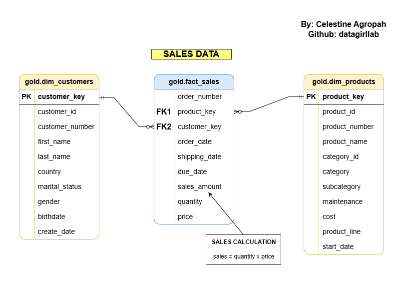
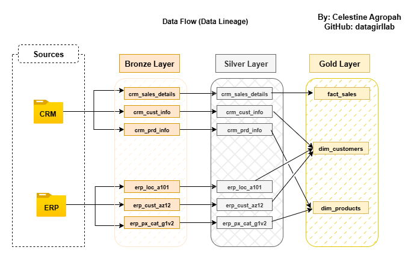

# SQL Data Warehouse Project

Hi there👋  
Welcome to my portfolio project on building a modern SQL data warehouse. This project demonstrates a comprehensive data warehousing and analytics solution — from setting up ETL pipelines and building a data model to creating analytics and reporting outputs.

## Tools Used:

SQL Server (Developer Edition)

SQL Server Management Studio (SSMS): For managing and interacting with the SQL Server database.

Notion: For project planning, documentation, and task management.

Draw.io: For designing the data architecture.

GitHub: For version control and collaboration   


---

## 🚧 Data Architecture

This project follows the **Medallion Architecture** model, organized into three key layers:



1. **Bronze Layer**: Stores raw data directly from the source systems. Data is ingested from CSV files into a SQL Server database without modifications.

2. **Silver Layer**: Cleans, standardizes, and transforms the raw data. Prepares the data for analysis and reporting.

3. **Gold Layer**: Contains business-ready data, modeled into a star schema (fact and dimension tables). Supports advanced reporting, analytics, and insights.

---

## 📊Data Model
This project follows a Star Schema data modeling approach. The dimension tables store the customers and product data. Fact Table store the sales data. All dimension tables are connected to the central fact table using surrogate keys.


## 🔄 Data Flow /Lineage

This project follows a layered architecture with a clear data flow:
From source systems (CRM and ERP) → Bronze Layer (raw data) → Silver Layer (cleaned and transformed data) → Gold Layer (business-ready analytical models).




## 🛣️ Overview

This project covers:

1. **Data Architecture**: Designing a modern data warehouse using the Medallion Architecture (**Bronze**, **Silver**, and **Gold** layers).
2. **ETL Pipelines**: Extracting, transforming, and loading data from source systems into the warehouse.
3. **Data Modeling**: Developing fact and dimension tables optimized for analytical queries.
4. **Analytics & Reporting**: Creating SQL-based reports and dashboards for actionable insights.

   ---
## 🎯Objectives and Scope

Project Objective:
Develop a modern SQL Server data warehouse to consolidate sales data, enabling analytical reporting, business intelligence (BI), and informed decision-making.

Scope: ⤵️

Ingest data from two source systems (ERP and CRM) via CSV files.

Cleanse and transform data to resolve quality issues.

Integrate sources into a unified, analysis-ready data model.

Focus on current datasets (no historization required).

Develop SQL-based analytics to deliver detailed insights into:

-Customer Behavior

-Product Performance

-Sales Trends

Provide clear documentation to support business and analytics teams.

---
## 📂 Repository Structure

```
sql-data-warehouse-project/
│
├── datasets/                           # Raw datasets used for the project (ERP and CRM data)
│
├── docs/                               # Project documentation and architecture details
│   ├── data_catalog.md                 # Catalog of datasets, including field descriptions and metadata
│   ├── data_lineage_flow.drawio                # Draw.io file showing the data flow diagram
│   ├── data_model.drawio              # Draw.io file for data models (star schema)
│   ├── datawarehouse_documentation    # Via Notion. Link included
│   ├── naming-convention.md           # Consistent naming guidelines for tables, columns, and files
│   ├── data_warehouse_architecture.drawio        # Draw.io file showing the project's architecture
│
├── scripts/                            # SQL scripts for ETL and transformations
│   ├── bronze/                         # Scripts for extracting and loading raw data
│   ├── silver/                         # Scripts for cleaning and transforming data
│   ├── gold/                           # Scripts for creating analytical models
│
├── tests/                              # Test scripts and data quality checks
│
├── README.md                           # Project overview and instructions
├── LICENSE                             # License information for the repository               
└── requirements.txt                    # Dependencies and requirements for the project
```
---


## 📄 Documentation

You can view the full project documentation here, hosted on Notion. <br>
🔗 https://sql-datawarehouse-project-by-celestine-agropah.notion.site/Data-Warehouse-Project-By-Celestine-Agropah-1e142e2b3980808799e3fa3d09e82979?pvs=74


## 📜 **License**

This project is licensed under the MIT License.
You are free to use, modify, and distribute this project, but **proper credit must be given**.

Project inspired by: **Baraa Khatib Salkini** 
